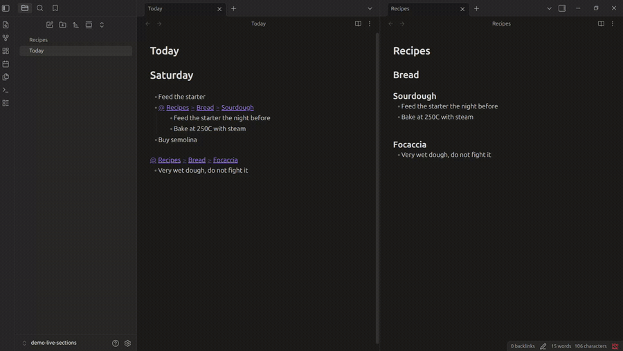
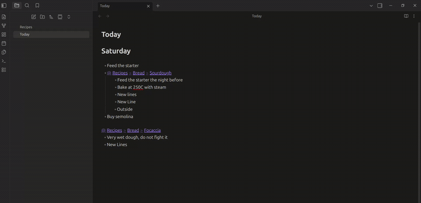

# Live Sections

Write `@[[Note#Heading]]` on a line and that section shows up there, editable, kept in sync with the note it lives in. In Live Preview, while you edit.

Obsidian's own `![[Note#Heading]]` renders the section read only, in embed styling. This keeps the text as text: you type in it, and the source file changes.

## Nested anchors

`@[[Recipes#Bread#Sourdough]]` walks the heading tree. A `Sourdough` under `Bread` is not the same heading as a top level `Sourdough`, and the other plugins that do this cut the link at the first `#` and cannot tell them apart.

## Collapsing

Sections collapse like a list item, with the arrow left of the bullet and your own fold shortcut. The plugin does not invent a key, it wraps `editor:toggle-fold`, so it follows whatever you have bound.

<!--  -->

## Keyboard

| Key | In the note | Inside a section |
| --- | --- | --- |
| Arrow up, arrow down | Steps into the section | Moves through it, and out at the edges |
| Ctrl+arrow | Jumps the whole section | Leaves it |
| Escape | | Back to the `@` line, to edit the link |
| Fold shortcut | Collapses the section on the cursor line | Folds inside the section |

Clicking the title opens the note. Clicking the `@` puts the cursor back on the raw line.

## Install

Not in the community store, and it will not be: it reaches into undocumented Obsidian internals to get a real editor inside the box, and wraps a core command. That is fine for a plugin you install yourself, and not fine for the store.

Copy `main.js`, `manifest.json` and `styles.css` into `<vault>/.obsidian/plugins/live-sections/`, or point [BRAT](https://github.com/TfTHacker/obsidian42-brat) at this repo.

## Settings

The trigger character, whether arrow keys leave a section at its edges, and how long to wait after typing before writing to the source file.

## Known gaps

- Text after the trigger on the same line stops it rendering. `@[[Note#Heading]] and a comment` stays raw.
- Long or deeply nested content inside a bullet renders with too much space at the start of each line.

## Tests

`node test/test.js` covers the parsing: nested anchors, where the box goes, the round trip that writes your edit back, and the keyboard steps. Obsidian is stubbed, so no vault is needed.
